<h1 align="center">Hi 👋, I'm Diksha Anand</h1>

  

## 📊 GitHub Stats

  
  

## 🔥 GitHub Streak

  

## 👾 Contribution Graph

  

## 🛠️ Tech Stack

  

## 👩‍💻 About Me

- 🎓 Final-year Computer Science & Engineering student
- 💻 Full Stack Developer
- ⚛️ Building applications with React, Node.js, Express & MongoDB
- 🧩 Practicing C++ and Data Structures & Algorithms
- 🤖 Interested in Machine Learning and Generative AI
- 🚀 Building real-world projects and contributing to open source
## 🚀 Featured Projects

### 🌐 Syncaura
Contributing to a full-stack web application involving project management and collaboration.

**Tech:** React • Node.js • PostgreSQL

### 🎬 Netflix Clone
React-based Netflix-inspired application with Redux state management.

**Tech:** React • Redux • JavaScript

### 📰 Fake News Detection
Machine learning model for detecting potentially fake news.

**Tech:** Python • Machine Learning

## 👾 My Contribution Graph

  

